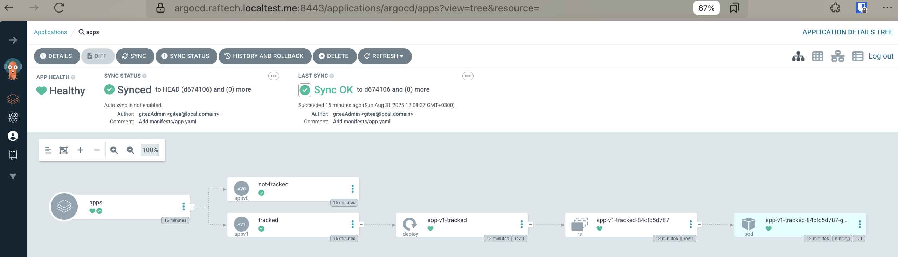

# FAQ

1. **What is kro?**

   Kube Resource Orchestrator (**kro**) is a new operator for Kubernetes that
   simplifies the creation of complex Kubernetes resource configurations. kro
   lets you create and manage custom groups of Kubernetes resources by defining
   them as a _ResourceGraphDefinition_, the project's fundamental custom resource.
   ResourceGraphDefinition specifications define a set of resources and how they relate to
   each other functionally. Once defined, resource groups can be applied to a
   Kubernetes cluster where the kro controller is running. Once validated by
   kro, you can create instances of your resource group. kro translates your
   ResourceGraphDefinition instance and its parameters into specific Kubernetes resources
   and configurations which it then manages for you.

2. **How does kro work?**

   kro is designed to use core Kubernetes primitives to make resource grouping,
   customization, and dependency management simpler. When a ResourceGraphDefinition is
   applied to the cluster, the kro controller verifies its specification, then
   dynamically creates a new CRD and registers it with the API server. kro then
   deploys a dedicated controller to respond to instance events on the CRD. This
   microcontroller is responsible for managing the lifecycle of resources
   defined in the ResourceGraphDefinition for each instance that is created.

3. **How do I use kro?**

   First, you define your custom resource groups by creating _ResourceGraphDefinition_
   specifications. These specify one or more Kubernetes resources, and can
   include specific configuration for each resource.

   For example, you can define a _WebApp_ resource group that is composed of a
   _Deployment_, pre-configured to deploy your web server backend, and a
   _Service_ configured to run on a specific port. You can just as easily create
   a more complex _WebAppWithDB_ resource group by combining the existing
   _WebApp_ resource group with a _Table_ custom resource to provision a cloud
   managed database instance for your web app to use.

   Once you have defined a ResourceGraphDefinition, you can apply it to a Kubernetes
   cluster where the kro controller is running. kro will take care of the heavy
   lifting of creating CRDs and deploying dedicated controllers in order to
   manage instances of your new custom resource group.

   You are now ready to create instances of your new custom resource group, and
   kro will respond by dynamically creating, configuring, and managing the
   underlying Kubernetes resources for you.

4. **Why did you build this project?**

   We want to help streamline and simplify building with Kubernetes. Building
   with Kubernetes means dealing with resources that need to operate and work
   together, and orchestrating this can get complex and difficult at scale. With
   this project, we're taking a first step in reducing the complexity of
   resource dependency management and customization, paving the way for a simple
   and scalable way to create complex custom resources for Kubernetes.

5. **How do I use KRO resources with ArgoCD?**

   To use KRO resources with ArgoCD, you need to add a specific tracking annotation
   to all templated resources in your ResourceGraphDefinition. 
   
   The following code needs to be added to each templated resource:

   ```yaml
   metadata:
      ownerReferences:
         - apiVersion: kro.run/v1alpha1
           kind: ${schema.kind}
           name: ${schema.metadata.name}
           uid: ${schema.metadata.uid}
           blockOwnerDeletion: true
           controller: false
      annotations:
        argocd.argoproj.io/tracking-id: ${schema.metadata.?annotations["argocd.argoproj.io/tracking-id"]}
   ```

   This annotation allows ArgoCD to properly track and manage the resources
   created by KRO instances. 


   
   
   Note that the example shown above depicts ArgoCD's default resource tracking 
   via annotations. You may choose to use `annotation+label` or just `label` and 
   if so the example has to be modified to support your configuration. 
   For more detailed information about ArgoCD resource tracking, please see the
   [ArgoCD documentation](https://argo-cd.readthedocs.io/en/stable/user-guide/resource_tracking/).

6. **Can I use this in production?**

   This project is in active development and not yet intended for production
   use. The _ResourceGraphDefinition_ CRD and other APIs used in this project are not
   solidified and highly subject to change.
